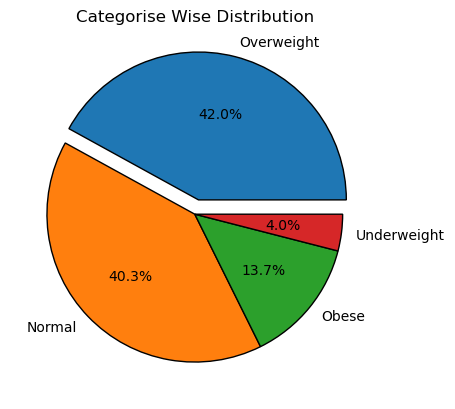

🔗 View the full report notebook here: https://nbviewer.org/github/MrigankKumawat/Health-Data-Analysis/blob/main/Health%20Data%20Analysis%20Report.ipynb

# 🩺 Health Data Analysis Project

## 📌 Overview
This project explores a medical dataset using Python for data cleaning, transformation, and visualizations. The goal is to uncover insights related to BMI, cholesterol, smoking habits, and physical activity levels.

---

## 🧰 Tools & Libraries Used
- Python 🐍
- Pandas 🐼
- NumPy 🔢
- Matplotlib 📊

---

## 📊 Key Analyses Performed
- Handled null values in various health attributes
- Added BMI Category & Activity Level columns
- Analyzed:
  - Average BMI by gender
  - Cholesterol levels: smokers vs non-smokers
  - Health Risk Scores by gender & lifestyle
- Top 5 people with highest health risk
- Exported cleaned data to CSV

---

## 📈 Visualizations
- Line Chart: Age vs Health Risk Score
- Bar Chart: Gender vs Average BMI
- Pie Chart: BMI Category Distribution
- Histogram: Blood Pressure Distribution
- Subplots: Combined view of various insights

---

## 📊 Sample Visuals from the Report:
### Category Wise Distribution


## 🗃️ Dataset
Used a health dataset with columns like:
- Age, Gender, BMI, Cholesterol, Blood Pressure
- Smoker Status, Physical Activity, Health Risk Score

---

## 🚀 Run It
```bash
pip install pandas numpy matplotlib
python health_analysis.py
